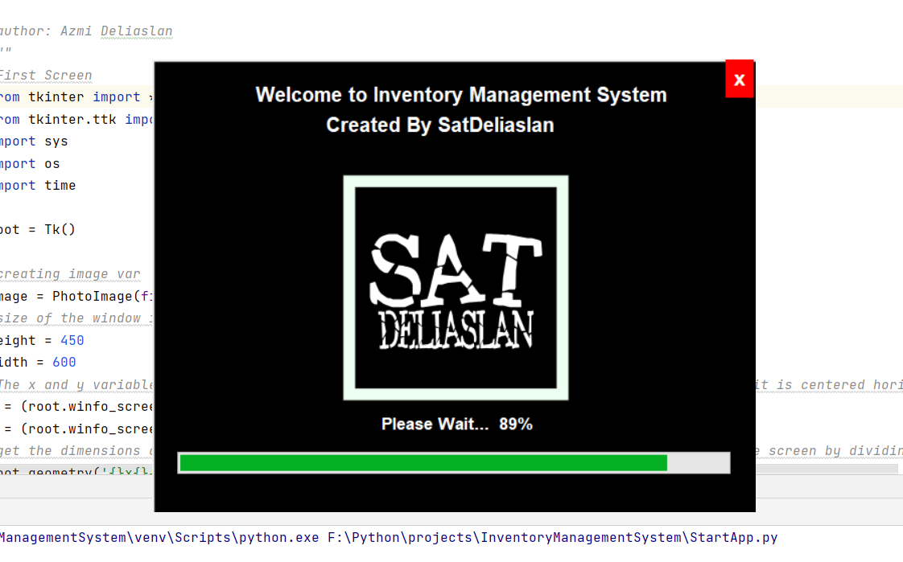
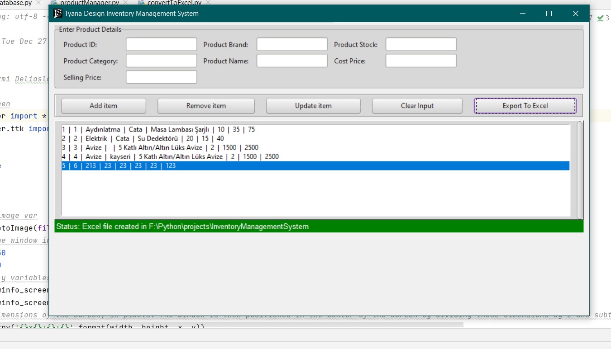

	
	

# Inventory Management System With Python

I have developed a GUI application for desktop made using Tkinter to manage product inventory. 
You can 
- Create
- Read 
- Update
- Delete 
product information from the database. 
You can export inventory data to an excel file.

It accepts data into the following fields, from the user:
- Product ID
- Product Category
- Product Brand
- Product Name
- Product Stock
- Cost Price
- Selling Price

### Libraries Used 

- **sqlite3**   | library for working with SQLite databases in Python.
- **openpyxl**  | library for reading and writing Excel files in Python
- **Tkinter**   | library for creating graphical user interfaces (GUIs) in Python. https://realpython.com/python-gui-tkinter/
- **ttkthemes** | third-party library that provides additional themes and styles for the Tkinter library https://ttkthemes.readthedocs.io/en/latest/index.html

### Changelog v1.0 - 27.12.22
#### First Commit
- Main program created

### Alert
İf you are not a developer, u can t open the application for now!
